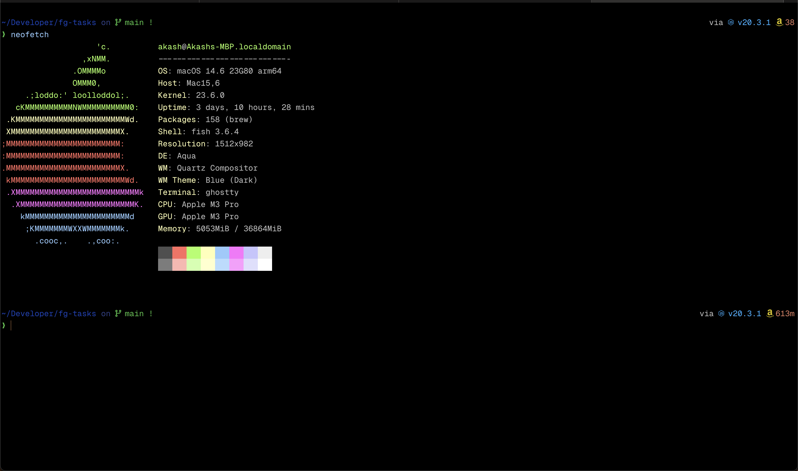
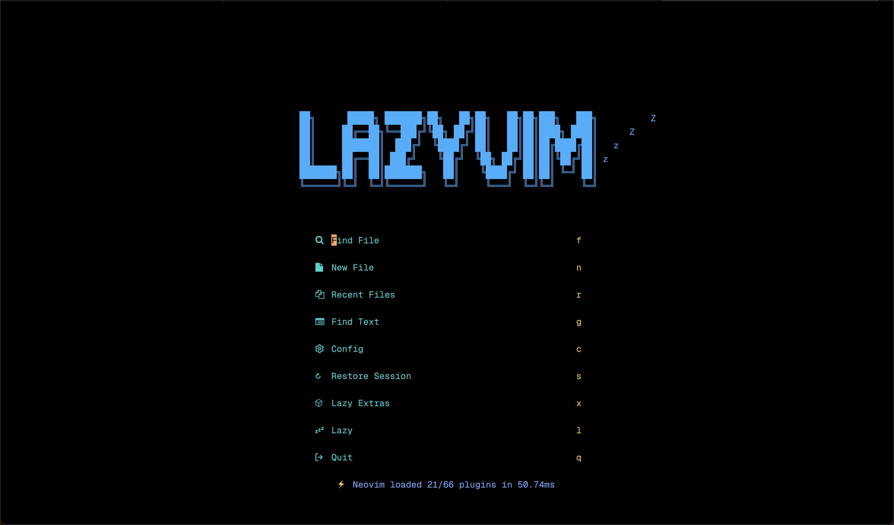

# dotfiles

My dotfiles for `macOS Ventura 13.5.2 (22G91)`

## Setup

- Shell: `fish`
- Editor: `neovim`
- Terminal Emulator: `Ghostty`

## Installation

1. Inspect dotfiles.
2. Find a cool thing. 😎
3. Add it to your dotfiles. 😉

## Screenshot

## Note

- DO NOT RUN `install.sh` directly on your machine. It'll overwrite your own files.
